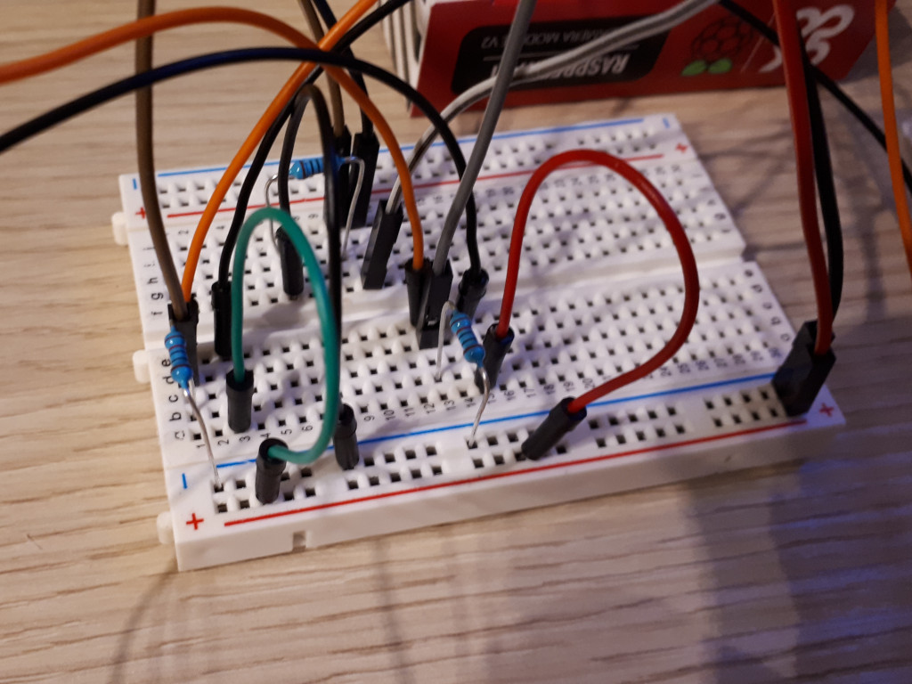
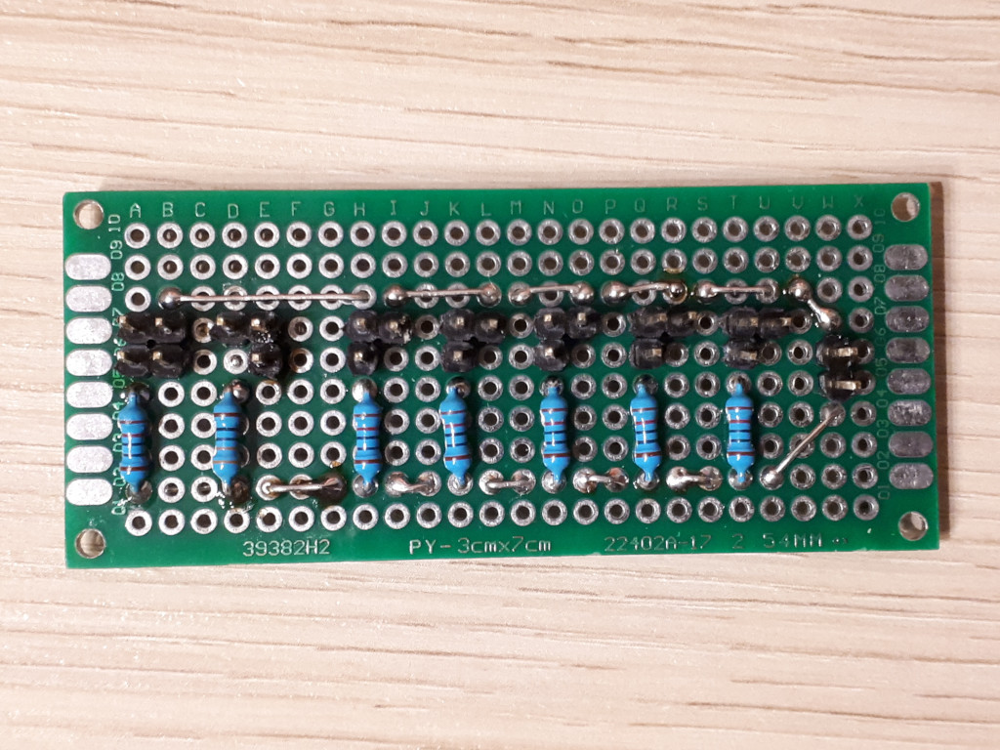
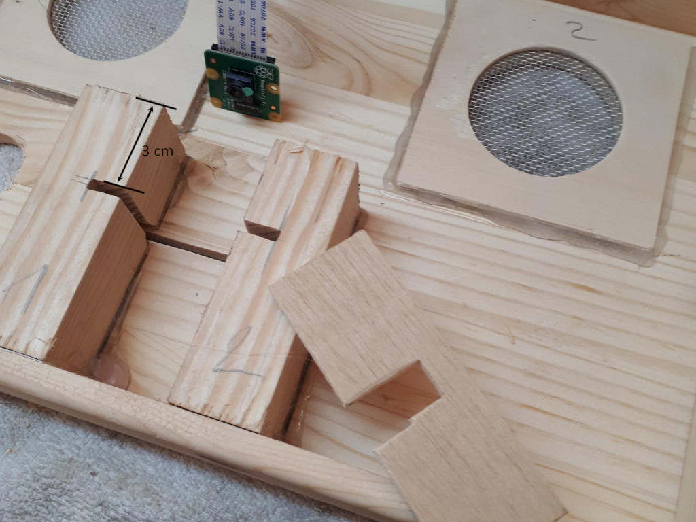
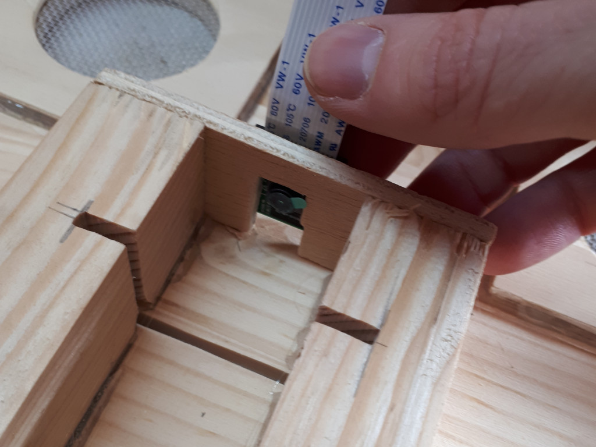

# AudioBox for Kids

1. The project
1. Shopping list
1. Setup raspian environment (install basic software)
    * a) System configuration
    * b) Setup audio device for mocp (music over console)
    * c) Install and setup AudioPI Software
    * d) Start/Stop AudioPi service
1. Control unit for the buttons and LEDs
1. AudioBox case
    * a) Prepare the case
    * b) Install components
1. Create qr code cards
1. Information

# 1. The project

For my daugther I was looking for a simple device that she can play her audio stories or her music. She is almost 4 years old, so the interface have to be very simple and stable :).

Features:
 - scan qr code to play your music files or audio stories
 - creative (own) design of the case
 - sleeptimeer
 - (optional) streaming web radio or something else
 - (optional) no radiation through bluetooth or wlan (with RaspberryPi 2)

# 2. Shopping list

Shopping list for the AudioBox:

| Object | Price | Link | Comment |
| --- | --- | --- | --- |
|RASPBERRY PI 2 MODEL B 1 GB RAM|35,49 €|[Conrad](https://www.conrad.de/de/p/raspberry-pi-2-b-1-gb-4-x-0-9-ghz-raspberry-pi-1316978.html)|-|
|RASPBERRY PI CAMERA V2 8MP IR|29,99 €|[Conrad](https://www.conrad.de/de/p/raspberry-pi-camera-module-v2-8mp-cmos-farb-kameramodul-passend-fuer-raspberry-pi-1438999.html)|I think another camera module for ~5-10 € is also enough! **Important:** It must be a model where you can adjust the focus!|
|Raspberry PI Netztei (original!):|6,90 €|-|-|
|Kabel:|8,99 €|[Amazon](https://www.amazon.de/gp/product/B07KC43D2C/ref=ppx_yo_dt_b_asin_title_o06_s00?ie=UTF8&psc=1)|-|
|Kiste:|9,95 €|[Amazon](https://www.amazon.de/gp/product/B016UYWX0E/ref=ppx_yo_dt_b_asin_title_o09_s00?ie=UTF8&psc=1)|-|
|Platinen:|6,49 €|[Amazon](https://www.amazon.de/gp/product/B078HV79XX/ref=ppx_yo_dt_b_asin_title_o05_s00?ie=UTF8&psc=1)|-|
|Netzwerk Buchse:|6,99 €|[Amazon](https://www.amazon.de/gp/product/B07TXHRNJD/ref=ppx_yo_dt_b_asin_title_o07_s00?ie=UTF8&psc=1)|-|
|Lautsprecher:|9,99 €|[Amazon](https://www.amazon.de/gp/product/B01HDR5EIK/ref=ppx_yo_dt_b_asin_title_o07_s00?ie=UTF8&psc=1)|-|
|Netzwerkkabel:|3,85 €|[Amazon](https://www.amazon.de/gp/product/B01AWK81VM/ref=ppx_yo_dt_b_asin_title_o08_s00?ie=UTF8&psc=1)|-|
|Raspberry PI Gehäuse:|5,99 €|[Amazon](https://www.amazon.de/gp/product/B00UCSO6SW/ref=ppx_yo_dt_b_asin_title_o09_s00?ie=UTF8&psc=1)|-|
|USB-Soundkarte:|7,99 €|[Amazon](https://www.amazon.de/gp/product/B01N905VOY/ref=ppx_yo_dt_b_asin_title_o00_s00?ie=UTF8&psc=1)|-|
|SD-Karte (32 GB):|9,00 €|[Amazon](https://www.amazon.de/gp/product/B06XWMQ81P/ref=ppx_yo_dt_b_asin_title_o08_s00?ie=UTF8&psc=1)|-|
|Knöpfe:|9,99 €|[Amazon](https://www.amazon.de/gp/product/B071WP4ZW4/ref=ppx_yo_dt_b_asin_title_o08_s00?ie=UTF8&psc=1)|-|
|Total |~150 €|-|-|

For building and testing the control unit i needed some basic equipment:

| Object | Price | Link | Comment |
| --- | --- | --- | --- |
|Abbiegevorrichtung:|2,98 €|[Amazon](https://www.amazon.de/gp/product/B000YIWM18/ref=ppx_yo_dt_b_asin_title_o08_s00?ie=UTF8&psc=1)|Only needed temporarily. Not needed for product.|
|Lötkolben:|15,99 €|[Amazon](https://www.amazon.de/gp/product/B07ZWTCR3G/ref=ppx_yo_dt_b_asin_title_o00_s00?ie=UTF8&psc=1)|Only needed temporarily. Not needed for product.|
|HDMI-Adapter:|7,59 €|[Amazon](https://www.amazon.de/gp/product/B075GZ8DX7/ref=ppx_yo_dt_b_asin_title_o07_s00?ie=UTF8&psc=1)|Only needed temporarily. Not needed for product.|
|Steckbrett + Zubehör:|12,99 €|[Amazon](https://www.amazon.de/gp/product/B01J79YG8G/ref=ppx_yo_dt_b_asin_title_o08_s00?ie=UTF8&psc=1)|Only needed temporarily. Not needed for product.|
|Total |~40 €|-|-|

# 3. Setup raspian environment

Prepare the raspberry pi.
Download and install "Raspbian Buster Lite" (without desktop) on your SD card.
After booting your raspberry, do the following steps to configure it:

## a) System configuration
~~~bash
#start raspian configuration and do the following steps
> sudo raspi-config
# --> set localization (de-de) and keyboard layout
# --> activate "camera module"
# --> activate "auto login"
# --> activate "ssh"
# --> update your system
~~~

After that, install all necessary software components.

~~~bash
#Systemupdate
> sudo apt update
> sudo apt upgrade

#QR-Code Software
> sudo apt-get install zbar-tools

#Audioplayer for Playlists
> sudo apt-get install moc moc-ffmpeg-plugin

#Audioplayer for commands
> sudo apt install mpg321

#Install Python Raspberry GPIO
> sudo apt-get install python3-rpi.gpio

#GitClient
> sudo apt-get install git
~~~

## b) Setup audio device for mocp

### Setup USB audio as default _(for system)_

Get number of sound card:

~~~bash
> aplay -l
~~~

In result search for the number of the USB audio device (here "*Karte 1: Device..."*)

~~~bash
**** Liste der Hardware-Geräte (PLAYBACK) ****
Karte 0: ALSA [bcm2835 ALSA], Gerät 0: bcm2835 ALSA [bcm2835 ALSA]
  Sub-Geräte: 7/7
  Sub-Gerät #0: subdevice #0
  Sub-Gerät #1: subdevice #1
  Sub-Gerät #2: subdevice #2
  Sub-Gerät #3: subdevice #3
  Sub-Gerät #4: subdevice #4
  Sub-Gerät #5: subdevice #5
  Sub-Gerät #6: subdevice #6
Karte 0: ALSA [bcm2835 ALSA], Gerät 1: bcm2835 IEC958/HDMI [bcm2835 IEC958/HDMI]
  Sub-Geräte: 1/1
  Sub-Gerät #0: subdevice #0
Karte 0: ALSA [bcm2835 ALSA], Gerät 2: bcm2835 IEC958/HDMI1 [bcm2835 IEC958/HDMI1]
  Sub-Geräte: 1/1
  Sub-Gerät #0: subdevice #0
Karte 1: Device [USB Audio Device], Gerät 0: USB Audio [USB Audio]
  Sub-Geräte: 1/1
  Sub-Gerät #0: subdevice #0
~~~

The USB sound device can be made the default audio device by editing a system file "alsa.conf":

~~~bash
> sudo nano /usr/share/alsa/alsa.conf
~~~
Scroll and find the following two lines:

~~~bash
defaults.ctl.card 0
defaults.pcm.card 0
~~~

Change the 0 to a 1 to match the card number of the USB device :

~~~bash
defaults.ctl.card 1
defaults.pcm.card 1
~~~

To save the file and return to the command line use [CTRL-X], [Y], [ENTER].

### Test sound card (after reboot!)

~~~bash
> speaker-test -c2
# or download a sample file and play
> wget https://www.kozco.com/tech/piano2.wav
> aplay piano2.wav
~~~

### Setup USB audio as default audio device _(for mocp only)_
Do this step after c) "Install and setup AudioPi".

This step is only necessary if our cardnumber not equals 1.
~~~bash
#Config USB soundcard for mocp and set your card number
> nano ~/.moc/config
~~~

## c) Install and setup AudioPi

~~~bash
#Switch to "home" (~) and checkout sources from github
> cd ~
/home/pi> git clone https://github.com/moasda/audiopi.git

#Run install script
/home/pi> chmod 755 ./audiopi/install/install.sh
/home/pi> ./audiopi/install/install.sh
~~~

## d) Start/Stop AudioPi service
~~~bash
#Stop AudioPi service
> sudo systemctl stop audiopi.service

#Stop AudioPi service
> sudo systemctl start audiopi.service

#Check AudioPi service status
> sudo systemctl status audiopi.service
~~~

**_Attention:_** After AudioPi started, you have 15 Minutes to stop the service until automatical shutdown happens!

# 4. Control unit for buttons and LEDs
Create and test the setup for buttons and LEDs ([see details](https://tutorials-raspberrypi.de/raspberry-pi-gpio-erklaerung-beginner-programmierung-lernen/)):

| The plan: | Test the plan: |
| --- | --- |
|||

| The finale platine: | |
| --- | --- |
|||

#todo: table: Pins & GPIOs on the PI

# 5. AudioBox case
Empty box with holes for the buttons, speakers and qr code card.
I used a metal mosquito screen to protect the speakers.

Building the photobox for the qr code cards.

# 6. Create qr code cards

Create the qr codes for example with the online tool "([the qrcode generator](https://www.the-qrcode-generator.com))".

## Audio cards

@todo

## Special cards

- update system
  @todo

- sync audio files
  @todo

- timer
  @todo

- commands
  @todo

# 7. Information

## Other useful commands

~~~bash
#check camera module (for adjusting focus)
> raspistill -d -w 320 -h 240 -r

#shudown the system
> sudo shutdown -h now
> sudo halt

#reboot the system
> sudo reboot

#Rename folders and replace space with underscore
> find ~/music -type d -name '* *' -execdir bash -c 'mv "$1" "${1// /_}"' bash {} \;
~~~

## Useful links

### Tutorials / Examples:

Example projects: ["Musikrakete"](http://www.tilman.de/projekte/musikrakete/) and ["Quido"](http://tilman.de/projekte/qudio/)

Used code snippets: ["Musikrakete"](https://github.com/tliero/musikrakete/blob/master/code/piplayer_pulse.py) and ["Quido"](https://github.com/tliero/qudio/blob/master/code/qudio.py)

[Raspberry GPIO Pins](https://pinout.xyz/)

Setup LEDs, Buttons and [develope the python code](https://tutorials-raspberrypi.de/raspberry-pi-gpio-erklaerung-beginner-programmierung-lernen/)

[HowTo: Powerbutton](https://howchoo.com/g/mwnlytk3zmm/how-to-add-a-power-button-to-your-raspberry-pi)

[HowTo: Power-LED](https://howchoo.com/g/ytzjyzy4m2e/build-a-simple-raspberry-pi-led-power-status-indicator)

[Python script as systemd daemon](https://www.thomaschristlieb.de/ein-python-script-mit-systemd-als-daemon-systemd-tut-garnicht-weh/)

### Inspiration:

[RPi-Jukebox-RFID](https://github.com/MiczFlor/RPi-Jukebox-RFID)

[Selfmade-Phoniebox](http://splittscheid.de/selfmade-phoniebox/#3A)

### Misc:

[Convert text to MP3](http://www.fromtexttospeech.com/) for info about start/stop of some scripts, started by qr code card

[Static IP for the PI](https://www.giga.de/zubehoer/raspberry-pi/tipps/raspberry-pi-statische-ip-adresse-vergeben/)
